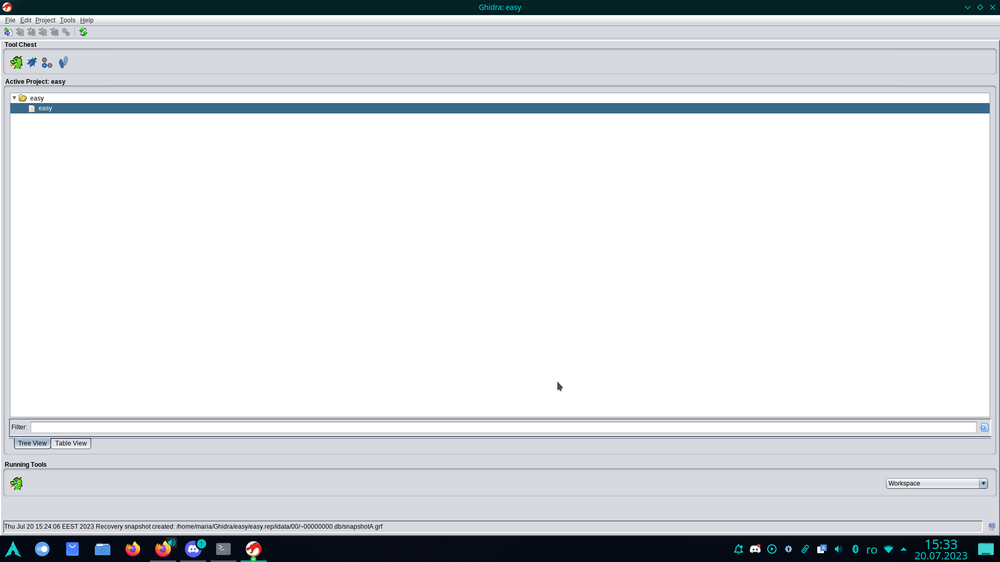
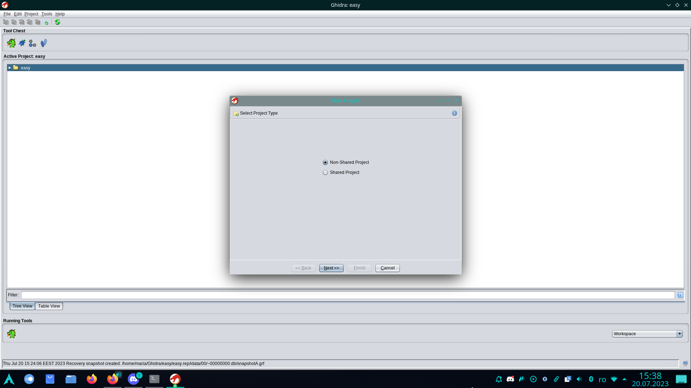
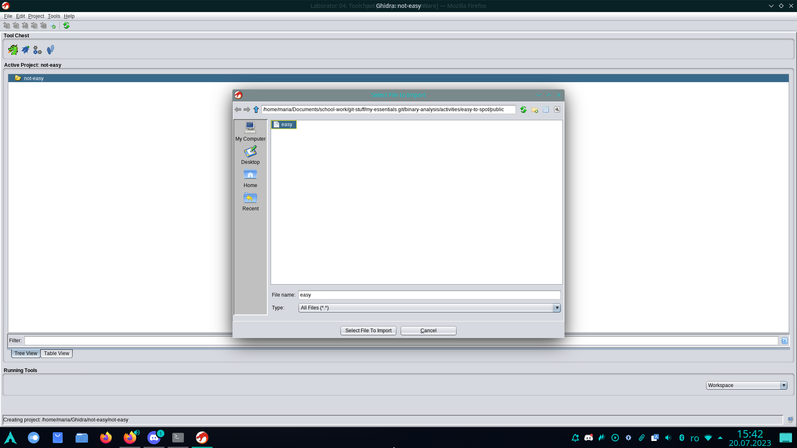
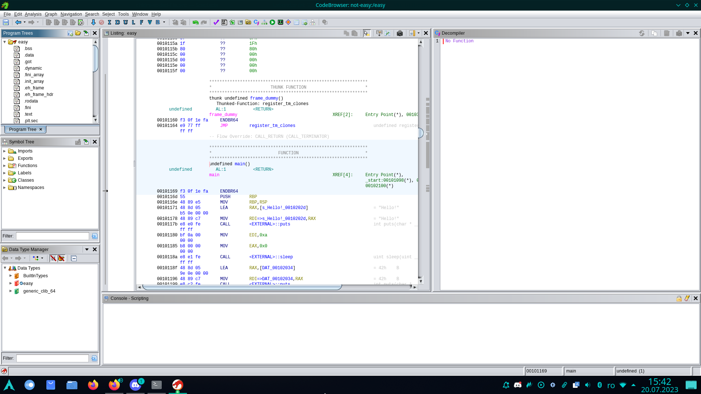
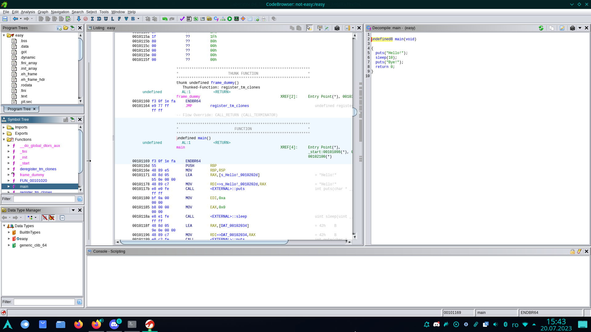

# Guide: Ghidra Tutorial - Decompiling

In this tutorial, we aim to show how to analyze the functionality of a simple binary that prompts for the input of a correct password to obtain a secret value.

>**WARNING**: In order to run Ghidra, access a terminal window and use the `ghidra` command.

Initially, when we run Ghidra, a window will appear showing our current projects.

We can create a new project and give it a suitable name.
To do this, we will use: `File → New Project` (or using the keyboard shortcut CTRL + N).

After creating the project, to add the executable file, we can use `File → Import file`, or drag the file into the directory we created.
Ghidra will suggest the detected format and the compiler used.
In more special cases, we may need to change these configurations, but for the purpose of this tutorial, Ghidra's suggestions are perfect.

The next step is to analyze the imported binary.
We can double-click on it.
Ghidra will ask us if we want to analyze it.
To do this, we will click `Yes` and then `Analyze`.

After the executable has been analyzed, Ghidra displays an interpretation of the binary information, which includes the disassembled code of the program.
Next, for example, we can try to decompile a function.
In the left part of the window, we have the `Symbol Tree` section;
if we open `Functions`, we can see that Ghidra has detected certain functions, including the `main` function in the case of this binary.
Therefore, if we double-click on `main`, the decompiled `main` function appears on the right, and in the central window, we see the corresponding assembly code.

We will notice that the decompiled code is not an exact representation of the source code from the file `crackme.c`, but it gives us a fairly good idea of how it works and looks.
Looking at the decompiled code, we notice that the `main` function has two long-type parameters named `param_1` and `param_2`, instead of the normal prototype `main(int argc, char *argv[])`.
The second parameter of `main` is of type "vector of pointers to character data" (which is generically interpreted as "array of strings").
Below is a generic perspective on how the vector is represented for a 64-bit system.
In the representation on the second line, `argp` should be understood as `char *argp = (char *)argv` in order for the calculation `argp + N` to make sense.

| argv[0]  |      argv[1]  |  argv[2]  |
|----------|:-------------:|----------:|
|   argp   |    argp + 8   | argp + 16 |

The difference in parameter types of the `main` function is due to interpretation: the binary is compiled for the amd64 architecture (which is an extension of the x86 architecture for 64-bit systems), and the size of a
[processor word](https://en.wikipedia.org/wiki/Word_(computer_architecture))
is 8 bytes (or 64 bits).
The size of a processor word is reflected in the size of a pointer and also in the size of a single parameter (if the parameter is smaller than a word, it is automatically extended to the size of a word).
Additionally, by coincidence, the size of a variable of type `long` is also 64 bits (the sizes of
[data types](https://en.wikipedia.org/wiki/C_data_types)
in C are not well-defined, only some lower limits for data types are defined).
This causes the interpretation of both parameters as `long`, as all parameters, regardless of type (int or pointer), are manipulated identically.
The calculation `param_2 + 8` is used to calculate the address of the second pointer in the `argv` vector (that is, `argv[1]`).
For a program compiled for the 32-bit x86 architecture, the address of `argv[1]` would have been `param_2 + 4`.

Using the information from the decompiled code, we can infer that the program expects a password as an argument, and it must be 8 characters long, with the character at position 3 being 'E' (the first character is at position zero).
