# Setup

## Virtual Machine

You can find the dedicated virtual machines for this course [here](https://repository.grid.pub.ro/cs/iocla/vm).
To access the page you will need to authenticate with your `cs.curs.pub.ro` credentials.

There are 2 virtual machines available:

- Lubuntu 24.04 (recommended for most students)
- Ubuntu Server 24.04 (recommended for Apple Silicon users, if the Lubuntu VM is too slow)

To log in, use the user `student` with the password `student`.
The `student` user has `sudo` privileges.

### Tools provided

Installed on the virtual machine are the following tools:

- [gcc-multilib](https://packages.ubuntu.com/search?keywords=gcc-multilib), [gcc](https://gcc.gnu.org/), [nasm](https://www.nasm.us/), [make](https://manpages.ubuntu.com/manpages/xenial/man1/make.1.html)
- [objdump](https://linux.die.net/man/1/objdump), [nm](https://linux.die.net/man/1/nm)
- [Ghidra](https://ghidra-sre.org/), [IDA](https://hex-rays.com/ida-pro)
- [pwndbg](https://github.com/pwndbg/pwndbg)
- Text editors ([vim](https://www.vim.org/), [sublime](https://www.sublimetext.com/), [vscode](https://code.visualstudio.com/))
- [TeamViewer](https://www.teamviewer.com/en/), [tmate](https://tmate.io/)
- [Python 2.7.18](https://www.python.org/downloads/release/python-2718/), [Python 3.12.3](https://www.python.org/downloads/release/python-3123/)
- [Radare2](https://www.radare.org/n/radare2.html)

## Running the VM

### Windows / Linux / Intel Macs

Get the OVA file (`PCLP2.ova`).
It can be imported in [VirtualBox](https://www.virtualbox.org/), as well as VMware.

{: .warning }

>Using VirtualBox, you may need to set the graphics controller to `VMSVGA`
>
>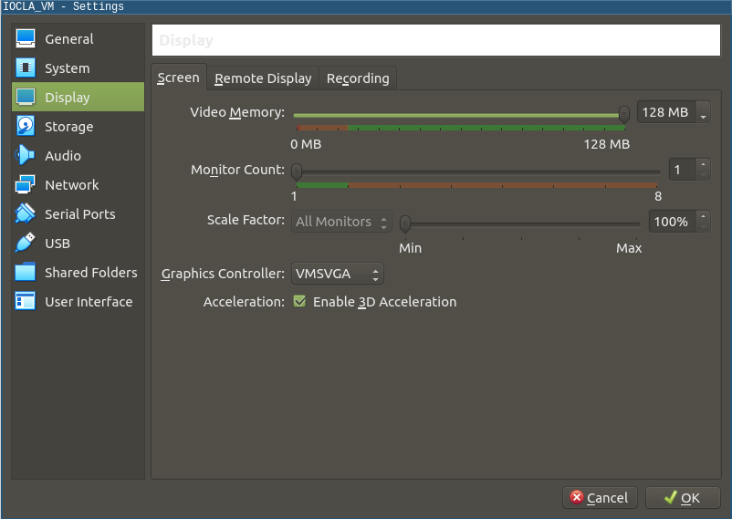

### Apple Silicon Macs

Since VirtualBox and VMware do not support emulating x86 on M series Macs, you will need to use the [UTM](https://mac.getutm.app/) app to run the VM.
After downloading the `UTM.dmg` file, open it and drag the app to the Applications folder.

UTM does not support importing OVA files, so you will need to download and use the virtual machine in the `qcow2` format.

- `PCLP2.qcow2` for Lubuntu
- `ubuntu_server_pclp2.qcow2` for Ubuntu Server

{: .warning }

Since the virtual machine will be emulated, it will experience a significant performance drop compared to running natively on an x86 host.
Thus, if you find the Lubuntu VM too slow, we recommend using the Ubuntu Server VM.

Use the following tutorial to import the virtual machine in UTM:

1. Click on `Create a New Virtual Machine`:
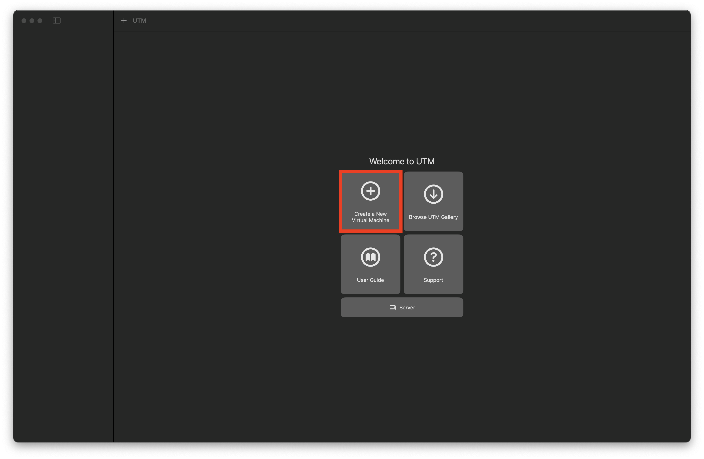

1. Select `Emulate`:
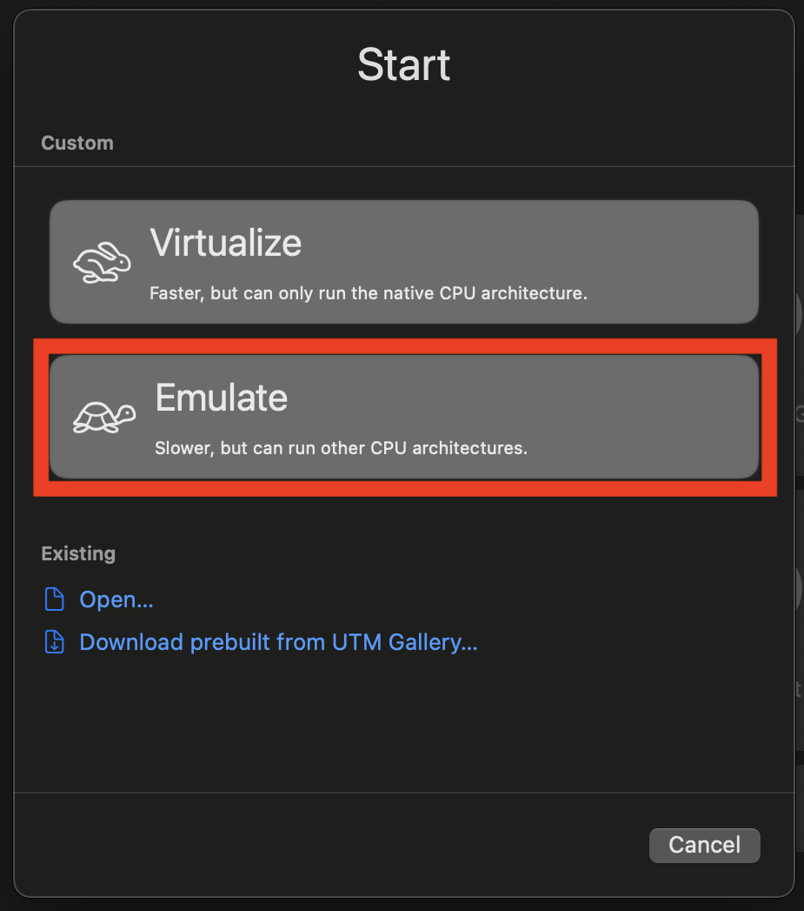

1. Select `Other`:
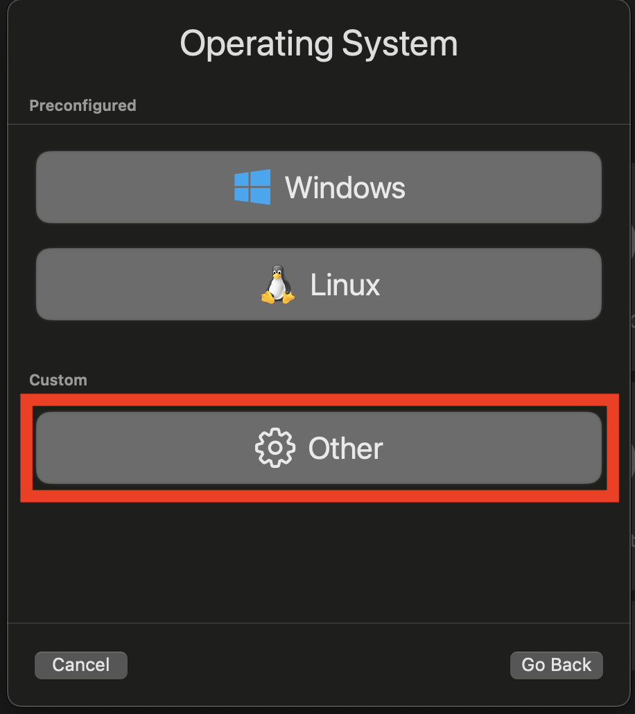

1. Check `None` for the boot device:
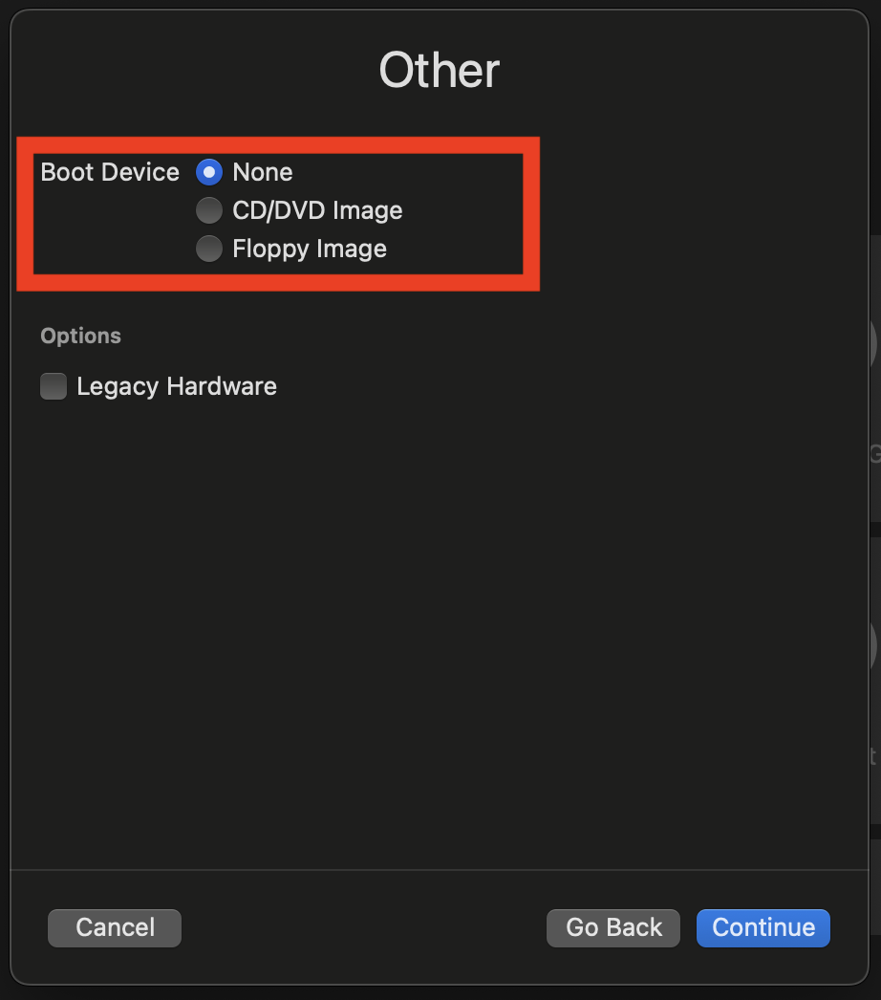

1. Allocate RAM to the VM (recommended 4GB):
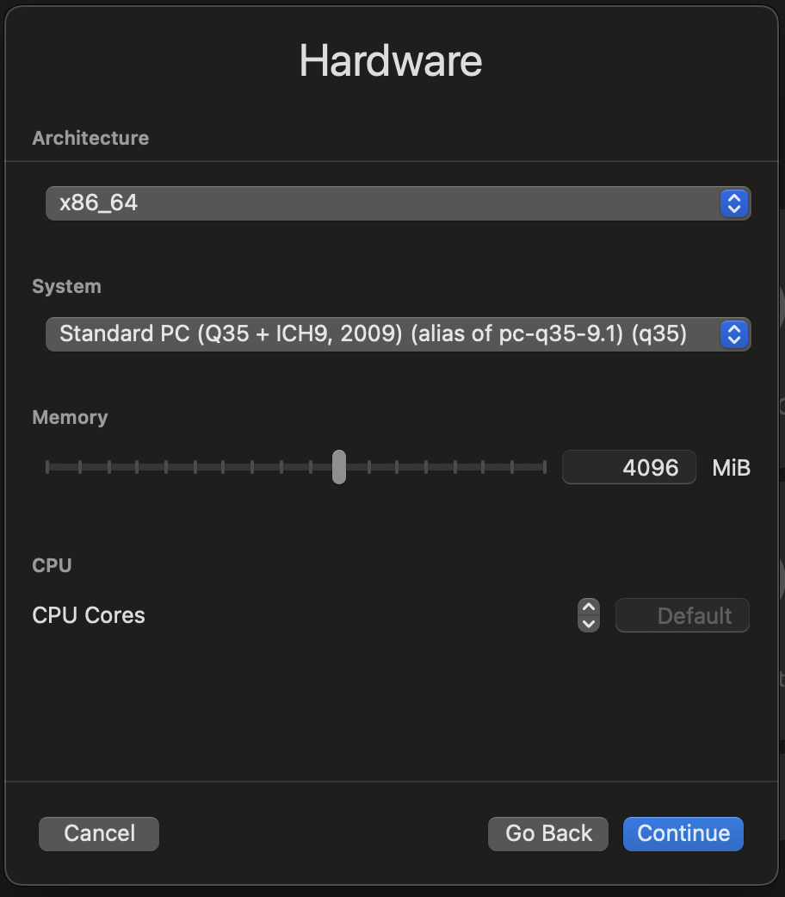

1. Set storage size (minimum 20GB):
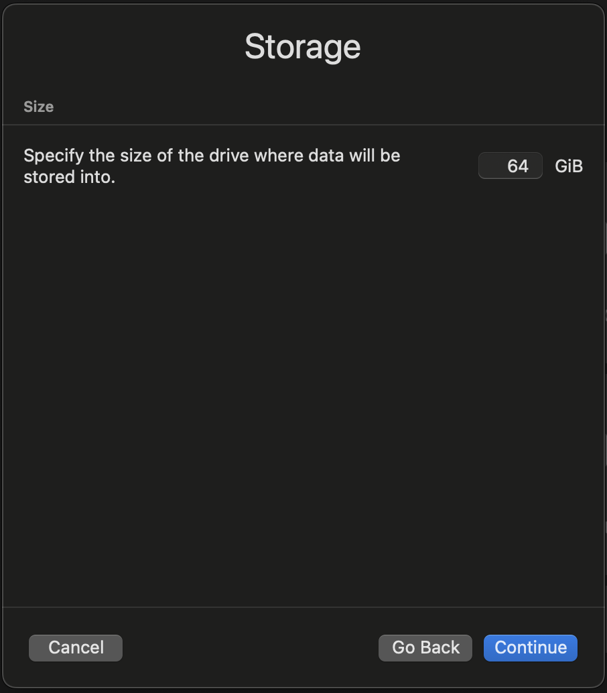

1. Skip shared directories setup:
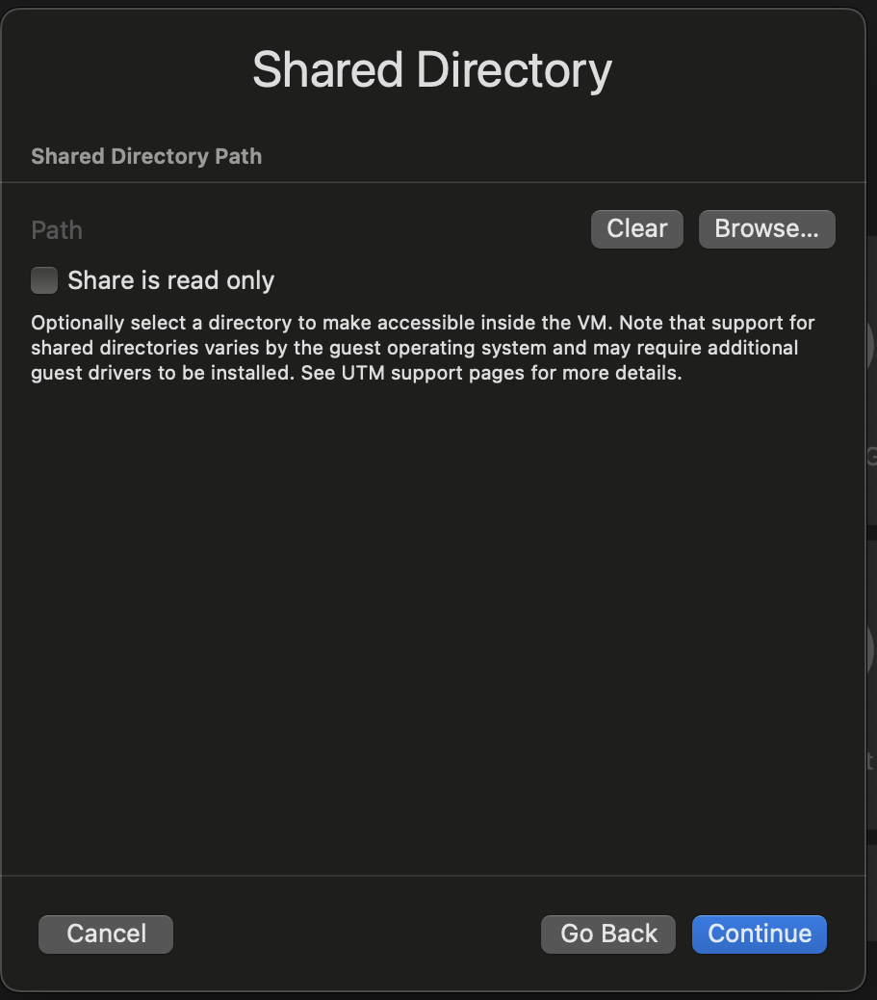

1. Name the VM:
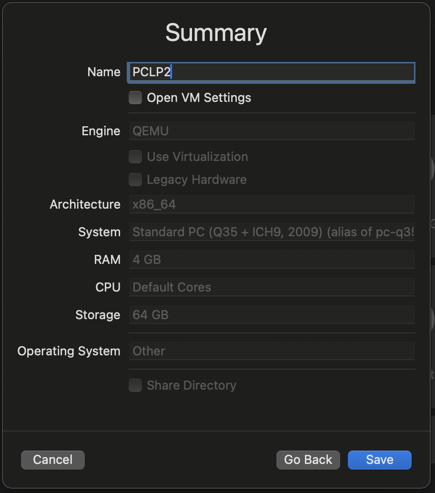

1. Right-click on the VM in the sidebar and select `Edit`:
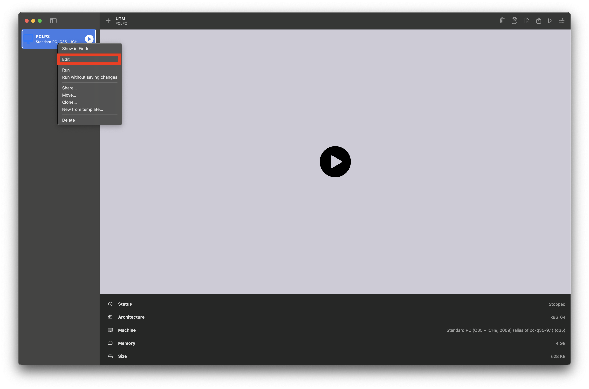

1. Go to `QEMU` and *disable* `UEFI boot`:
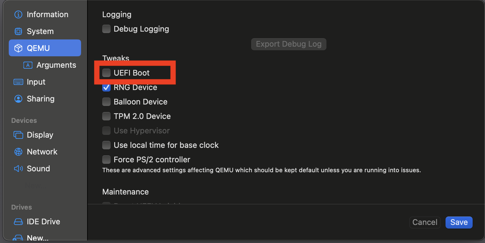

1. Go to `Drives` and select `New...`, then click `Import` and select the `qcow2` file:
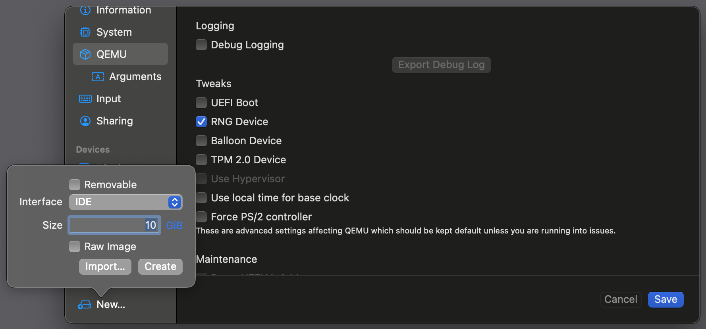

1. Right-click on the newly added drive and click `Move up`:
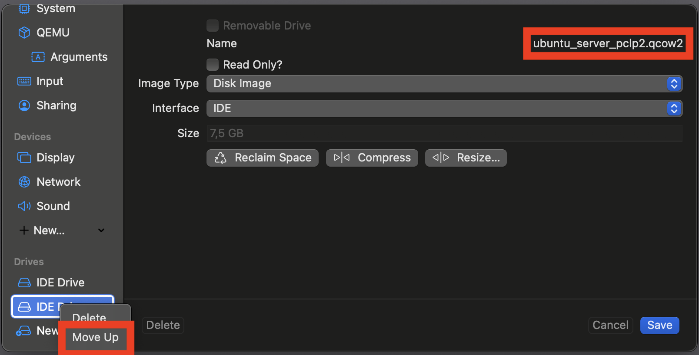

1. Save the edits and start the VM

{: .tip }

>The Ubuntu Server VM has an SSH server opened on port 22.
>You can connect to it from your host machine using the terminal or the [VSCode SSH extension](https://code.visualstudio.com/docs/remote/ssh).
>
>After starting the VM (it may take up to 2 minutes), you can find its IP address by running `ip a s`.
>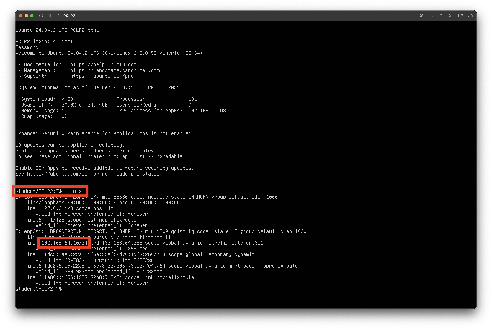
